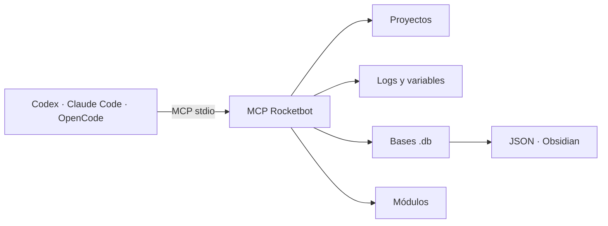

<div align="center">

# 🚀 MCP Rocketbot

**Conecta agentes de IA con proyectos, logs, variables, módulos y bases de datos de Rocketbot Studio.**

[](https://www.python.org/)
[](https://modelcontextprotocol.io/)
[](https://rocketbot.com/)
[](#instalación)
[](#pruebas)

[Instalación](#instalación) · [Agentes compatibles](#instalar-en-agentes) · [Tools](#catálogo-de-tools) · [Seguridad](#seguridad)

</div>

---

## ✨ Qué permite hacer

| 🔎 Inspección | 🧾 Diagnóstico | 🧱 Construcción | 📚 Documentación |
|---|---|---|---|
| Explorar proyectos y archivos | Analizar logs y variables | Crear bases `.db` Rocketbot | Exportar flujos a Obsidian |
| Buscar texto en proyectos | Verificar rutas detectadas | Validar módulos y parámetros | Generar catálogos JSON/Markdown |



## Requisitos

- Python `>=3.10`
- Rocketbot Studio instalado
- acceso a proyectos, logs y variables de Rocketbot

## Instalación

Instala `uv` una sola vez:

```powershell
# Windows
winget install --id=astral-sh.uv -e
```

```bash
# macOS
brew install uv

# Linux o macOS sin Homebrew
curl -LsSf https://astral.sh/uv/install.sh | sh
```

Para desarrollar o ejecutar esta copia:

```powershell
uv sync
uv run mcp-rocketbot
```

## Instalar en agentes

Todos los clientes ejecutan el mismo servidor aislado directamente desde Git:

```text
uvx --from git+https://github.com/JohanSabino/MCPRB.git mcp-rocketbot
```

### Codex CLI

```powershell
codex mcp add rocketbot -- uvx --from git+https://github.com/JohanSabino/MCPRB.git mcp-rocketbot
codex mcp get rocketbot
```

Atajos de una sola línea:

```powershell
# Instalar y registrar el MCP con sus dependencias
uvx --from git+https://github.com/JohanSabino/MCPRB.git mcp-rocketbot install

# Actualizar desde main y refrescar la caché
uvx --refresh --from git+https://github.com/JohanSabino/MCPRB.git mcp-rocketbot update

# Desinstalar el registro y limpiar la caché específica del paquete
uvx --from git+https://github.com/JohanSabino/MCPRB.git mcp-rocketbot uninstall
```

`install` y `update` registran `rocketbot` en Codex CLI. `uninstall` no borra la
caché global de uv ni otras herramientas; solo elimina el registro y la caché
de este paquete. Después de cada comando, reinicia Codex o recarga los MCP.

### Claude Code

```powershell
claude mcp add --transport stdio --scope user rocketbot -- uvx --from git+https://github.com/JohanSabino/MCPRB.git mcp-rocketbot
claude mcp get rocketbot
```

### OpenCode

Agrega esto a `opencode.json`:

```json
{
  "$schema": "https://opencode.ai/config.json",
  "mcp": {
    "servers": {
      "rocketbot": {
        "type": "local",
        "command": [
          "uvx",
          "--from",
          "git+https://github.com/JohanSabino/MCPRB.git",
          "mcp-rocketbot"
        ]
      }
    }
  }
}
```

## Configuración

Crear `.env` desde `.env.example`.

```powershell
Copy-Item .env.example .env
```

Variables:

```env
ROCKETBOT_HOME=
ROCKETBOT_PROJECTS_DIR=
ROCKETBOT_LOGS_DIR=
ROCKETBOT_MODULES_DIR=
ROCKETBOT_VARIABLES_FILE=
MCP_TRANSPORT=stdio
MCP_HOST=127.0.0.1
MCP_PORT=8000
MCP_SSE_PATH=/sse
MCP_STREAMABLE_HTTP_PATH=/mcp
MCP_ENABLE_RESOURCES=false
```

Notas:

- `mcp_server.py` sí respeta `MCP_TRANSPORT`
- `main.py` fuerza `stdio`
- `MCP_ENABLE_RESOURCES=false` evita que OpenCode muestre resources como comandos `@`
- no subir `.env`
- no subir `.venv`

## Ejecutar servidor

### Local `stdio`

```powershell
uv run mcp-rocketbot
```

### HTTP `streamable-http`

En `.env`:

```env
MCP_TRANSPORT=streamable-http
MCP_HOST=127.0.0.1
MCP_PORT=8000
MCP_STREAMABLE_HTTP_PATH=/mcp
```

Ejecutar:

```powershell
$env:MCP_TRANSPORT="streamable-http"
uv run mcp-rocketbot
```

Endpoint:

```text
http://127.0.0.1:8000/mcp
```

### Inspector MCP

```powershell
uv run mcp dev mcp_server.py
```

## Smoke test local

```powershell
uv run python mcp_client.py
```

Qué hace:

- conecta por `stdio`
- lista tools
- lista resources si están habilitados
- lee `rocketbot://paths` solo si está disponible

## Pruebas

```powershell
uv run python -m unittest discover -s tests -v
```

## Consumo

El usuario conversa con el agente del IDE. El agente interpreta el prompt y llama
las tools MCP con JSON. No es necesario editar ni llamar directamente
`mcp_server.py`.

### Analizar una DB existente

Prompt de ejemplo:

```text
Usa el MCP Rocketbot.

Toma esta DB:
C:\Bots\Facturacion\facturacion.db

1. Ejecuta export_rocketbot_db_json con include_raw_data=false.
2. Analiza los bots, subrobots, variables, módulos y comandos.
3. Resume el flujo por HU.
4. Señala módulos faltantes, variables sin uso y posibles errores.
5. Exporta la documentación a:
C:\Bots\Facturacion\documentacion

Usa export_rocketbot_db_obsidian para generar la documentación.
```

La ruta de la DB puede estar en cualquier carpeta accesible para el usuario que
ejecuta el MCP.

### Leer logs y variables desde cualquier ruta

Prompt de ejemplo:

```text
Usa el MCP Rocketbot.

Lee las últimas 300 líneas de:
D:\Ejecuciones\ClienteA\rocketbot.log

Después carga las variables desde:
D:\Ejecuciones\ClienteA\variables.json

Relaciona los errores del log con las variables, sin mostrar secretos completos.
```

Llamadas equivalentes:

```json
{
  "log_path": "D:\\Ejecuciones\\ClienteA\\rocketbot.log",
  "lines": 300
}
```

```json
{
  "variables_path": "D:\\Ejecuciones\\ClienteA\\variables.json"
}
```

Para listar una carpeta de logs:

```json
{
  "logs_path": "D:\\Ejecuciones\\ClienteA\\logs"
}
```

Si no se envían rutas, las tools mantienen el comportamiento anterior y usan
las rutas configuradas en `.env` o autodetectadas.

### Crear una DB desde un requerimiento

Prompt de ejemplo:

```text
Usa el MCP Rocketbot para crear:
C:\Bots\Salida\GestionCorreos.db

Si conoces la carpeta de módulos, úsala. Si no, permite que el MCP la detecte.

Requerimiento:
- Crear un bot principal llamado main.
- HU01: conectarse a Microsoft 365 y obtener correos no leídos.
- HU02: leer cada correo y guardar asunto, remitente y contenido.
- HU03: abrir el portal https://portal.ejemplo.com.
- HU04: escribir el dato extraído en el formulario y enviarlo.
- HU05: enviar un correo con el resultado.

Antes de construir el flujo:
1. Ejecuta search_rocketbot_module_commands para cada capacidad requerida.
2. Usa los nombres, comandos y campos reales encontrados en package.json.
3. No inventes módulos ni parámetros.
4. Separa cada HU en un subrobot.
5. Crea variables con la convención v<Scope><Type><Nombre>.
6. Haz que main ejecute las HU en orden.
7. Ejecuta validate_rocketbot_definition.
8. Genera la DB con create_rocketbot_db_file y overwrite=true.
9. Exporta la DB creada a JSON para verificar el resultado.
10. Informa bots creados, módulos usados y ruta final.
```

El agente debería ejecutar este flujo:

1. `search_rocketbot_module_commands`
2. construir el objeto JSON con `main`, HUs, variables y comandos
3. `validate_rocketbot_definition`
4. `create_rocketbot_db_file`
5. `export_rocketbot_db_json`

`create_rocketbot_db_file` valida módulos por defecto. Usa
`validate_modules=false` solo para generar una DB destinada a otra instalación
que tenga módulos diferentes.

Tipos de acción simplificados soportados:

- `set_variable`
- `exec_subrobot`
- `if`
- `for`
- `while`
- `try_catch`
- `break`
- `group`
- `open_browser`
- `wait_for_object`
- `click`
- `write_input`
- `db_connect`
- `read_file`
- `create_folder`
- `o365_connect`
- `o365_get_all_emails`
- `o365_read_email`
- `o365_send_email`

Otros comandos pueden generarse como módulos genéricos, pero deben construirse
con los valores reales del `package.json` del módulo.

La lógica de control es nativa de Rocketbot. No debe buscarse ni generarse como
un módulo externo.

Ejemplo:

```json
{
  "type": "try_catch",
  "try": [
    {
      "type": "for",
      "iterable": "{vLocLstCorreos}",
      "var": "vLocObjCorreo",
      "body": [
        {
          "type": "if",
          "condition": "'{vLocBooProcesar}' == 'True'",
          "then": [
            {
              "type": "o365_read_email",
              "email_id": "{vLocObjCorreo['id']}"
            }
          ],
          "else": [
            {
              "type": "break"
            }
          ]
        }
      ]
    }
  ],
  "catch": [
    {
      "type": "set_variable",
      "variable": "vLocBooError",
      "value": true
    }
  ]
}
```

Una acción desconocida solo se trata como módulo externo si incluye
`module_name` y `module`. De lo contrario, la creación falla indicando el tipo
no soportado.

Formato recomendado para un evento/comando de módulo:

```json
{
  "type": "module",
  "module_name": "Files",
  "module": "exists",
  "params": {
    "path": "C:\\Bots\\entrada.xlsx",
    "var_": "vLocBooArchivoExiste"
  }
}
```

Los nombres dentro de `params` deben coincidir con los `id` publicados por
`search_rocketbot_module_commands`. El catálogo completo sigue disponible con
`scan_rocketbot_modules_catalog`. Incluye valores predeterminados,
campos obligatorios, opciones y tipos de datos de cada entrada.

La carpeta de módulos se resuelve en este orden:

1. `ROCKETBOT_MODULES_DIR` en `.env`
2. `modules` dentro de `ROCKETBOT_HOME`
3. ubicaciones comunes de Rocketbot en Escritorio, Documentos y Program Files

También puede indicarse una ruta concreta:

```json
{
  "modules_dir": "D:\\Apps\\Rocketbot\\Rocketbot\\modules"
}
```

### Desde Inspector MCP

Ejemplo `get_rocketbot_paths`:

```json
{}
```

Ejemplo `list_project_files`:

```json
{
  "project_name": "MiProyecto"
}
```

Ejemplo `read_project_file`:

```json
{
  "project_name": "MiProyecto",
  "relative_path": "main.robot",
  "max_chars": 20000
}
```

### Crear `.db` desde JSON

Tool: `create_rocketbot_db_from_object`

```json
{
  "output_path": "C:/temp/robot.db",
  "overwrite": true,
  "bots": [
    {
      "name": "main",
      "description": "Flujo base",
      "version": "1.0.0",
      "project": {
        "project": {
          "commands": [],
          "ifs": [],
          "modules": [],
          "vars": [],
          "profile": {
            "name": "main",
            "description": "Flujo base"
          }
        }
      }
    }
  ]
}
```

### Exportar `.db` a JSON

Tool: `export_rocketbot_db_json`

```json
{
  "db_path": "C:/temp/robot.db",
  "output_json_path": "C:/temp/robot.json",
  "include_raw_data": false
}
```

### Exportar `.db` a Obsidian

Tool: `export_rocketbot_db_obsidian`

```json
{
  "db_path": "C:/temp/robot.db",
  "output_dir": "C:/temp/obsidian/robot",
  "include_raw_data": false
}
```

## Conversión prioritaria: Rocketbot → Python

Estas tools convierten una DB Rocketbot a un proyecto Python con estructura
tipo Makro: `main.py`, `HU/`, `Funciones/`, `config/config.xlsx`, `Inputs/`,
`Outputs/`, `Plantillas/`, `Logs/`, `Temp/`, `tests/` y `docs/`.

El flujo requiere revisión antes de generar archivos:

1. `plan_rocketbot_python_conversion` analiza la DB, identifica bots/HU,
   propone funciones y archivos, detecta duplicados y posibles secretos, y
   devuelve un `plan_id`. No crea archivos.
2. `generate_rocketbot_python_conversion` recibe el mismo `plan_id` con
   `approve: true` y genera el proyecto solo después de validar la propuesta.

Planificar:

```json
{
  "db_path": "C:/temp/robot.db",
  "output_dir": "C:/temp/robot_python",
  "template": "makro"
}
```

Generar después de revisar:

```json
{
  "db_path": "C:/temp/robot.db",
  "output_dir": "C:/temp/robot_python",
  "plan_id": "devuelto_por_la_tool_anterior",
  "approve": true,
  "template": "makro",
  "overwrite": false
}
```

La generación no copia comandos raw ni valores que parezcan secretos. Las
acciones que dependen del entorno, como SAP GUI, quedan marcadas para
adaptación manual.

Para optimizar proyectos Python grandes, se recomienda evaluar
[DeusData/codebase-memory-mcp](https://github.com/DeusData/codebase-memory-mcp)
para indexar el código, buscar símbolos, rastrear dependencias y analizar
impactos. Es opcional y no es una dependencia de ejecución de este MCP.

## 🧰 Catálogo de tools

| Área | Tool | Descripción |
|---|---|---|
| 🐍 Conversión | `plan_rocketbot_python_conversion` | Propone la estructura Python y devuelve un `plan_id` sin crear archivos. |
| 🐍 Conversión | `generate_rocketbot_python_conversion` | Genera la estructura aprobada usando un `plan_id` vigente. |
| 🧭 Entorno | `get_rocketbot_paths` | Devuelve las rutas de Rocketbot detectadas o configuradas. |
| 🧭 Entorno | `get_rocketbot_status` | Comprueba si las rutas existen y si provienen del archivo `.env`. |
| 📂 Proyectos | `list_projects` | Lista las carpetas de proyectos disponibles en Rocketbot. |
| 📂 Proyectos | `list_project_files` | Enumera los archivos contenidos en un proyecto. |
| 📂 Proyectos | `read_project_file` | Lee de forma segura un archivo usando una ruta relativa al proyecto. |
| 🔎 Búsqueda | `search_in_project` | Busca texto dentro de los archivos de un proyecto. |
| 🧾 Logs | `list_rocketbot_logs` | Lista logs desde una ruta indicada o desde la ubicación detectada. |
| 🧾 Logs | `read_rocketbot_log` | Lee las últimas líneas de un log concreto o del más reciente. |
| 🔐 Variables | `get_rocketbot_variables` | Carga variables desde archivos JSON, INI, ENV o TXT. |
| 🧱 Bases DB | `create_rocketbot_db_file` | Construye una `.db` desde una definición JSON simplificada. |
| 🧱 Bases DB | `create_rocketbot_db_from_object` | Persiste una lista de bots con estructura Rocketbot ya compilada. |
| 📤 Exportación | `export_rocketbot_db_json` | Convierte una `.db` en JSON editable para análisis y verificación. |
| 📚 Documentación | `export_rocketbot_db_obsidian` | Genera notas, índices y diagramas Markdown para Obsidian. |
| 🧩 Módulos | `scan_rocketbot_modules_catalog` | Escanea `package.json` y cataloga comandos y parámetros de módulos. |
| 🧩 Módulos | `search_rocketbot_module_commands` | Busca eventos concretos sin devolver el catálogo completo. |
| ✅ Validación | `validate_rocketbot_definition` | Detecta módulos inexistentes y parámetros obligatorios faltantes. |
| 📤 Exportación | `export_rocketbot_modules_json` | Exporta el catálogo de módulos a un archivo JSON. |
| 📚 Documentación | `export_rocketbot_modules_obsidian` | Exporta el catálogo de módulos como notas Markdown. |

## Resources

- deshabilitados por defecto
- habilitar con `MCP_ENABLE_RESOURCES=true`
- `rocketbot://paths`
- `rocketbot://variables`
- no son tools y no deben invocarse con `@` en OpenCode
- reiniciar el MCP o OpenCode después de cambiar esta variable

## Seguridad

- no versionar `.env`, `.venv`, credenciales, tokens ni secretos
- no pegar credenciales en prompts, issues, README ni ejemplos
- usar `include_raw_data=false` salvo necesidad real
- revisar logs y variables antes de compartirlos
- guardar `.db`, JSON y notas Obsidian fuera del repo si contienen datos sensibles
